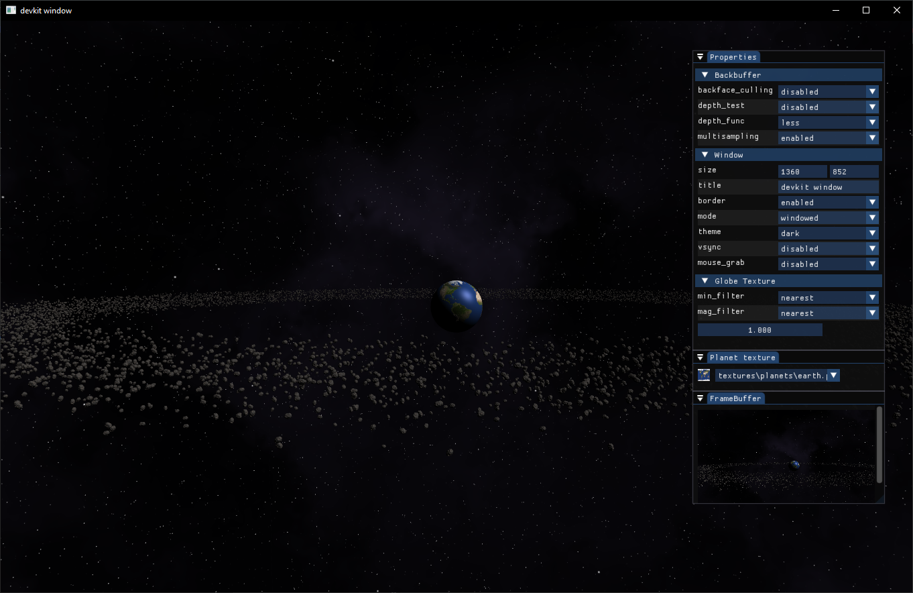
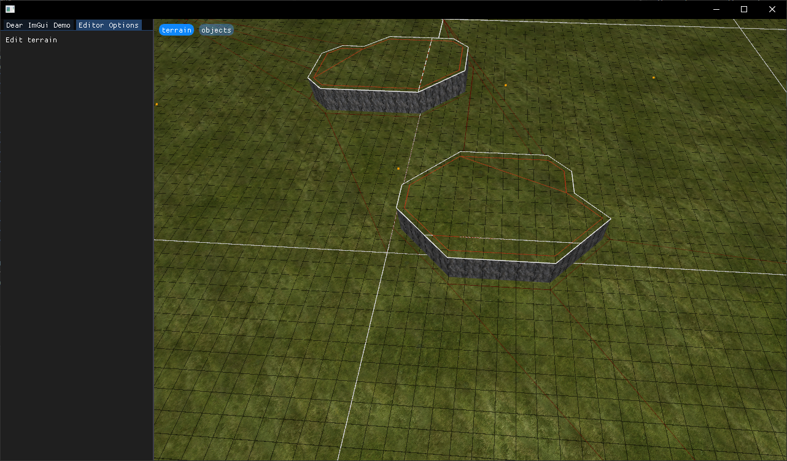

# DevKit

DevKit is a framework helping in prototyping and working on personal projects. 
It's goal is to provide a unified architecture to interact with third party libraries and as a collection of reusable data structures and algorithms. 
It hides very little from the user to allow for high customizability, but reducese boilerplate.

## Build

The project uses CMake, and vcpkg to manage dependencies. 

```bash
cmake -B build . && cmake --build build --config Release
```

## Namespaces

Namespace | Description
--------- | ---
common    | TODO
dbg       | TODO
algo      | TODO
geom      | TODO
io        | TODO
gfx       | TODO

## Examples

|  |  |
|--|--|
| examples/01_basic<br>  | examples/03_rts<br>  |
